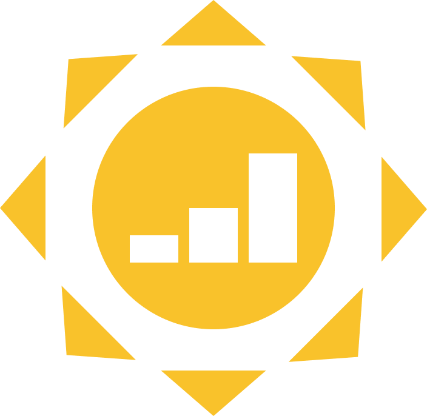
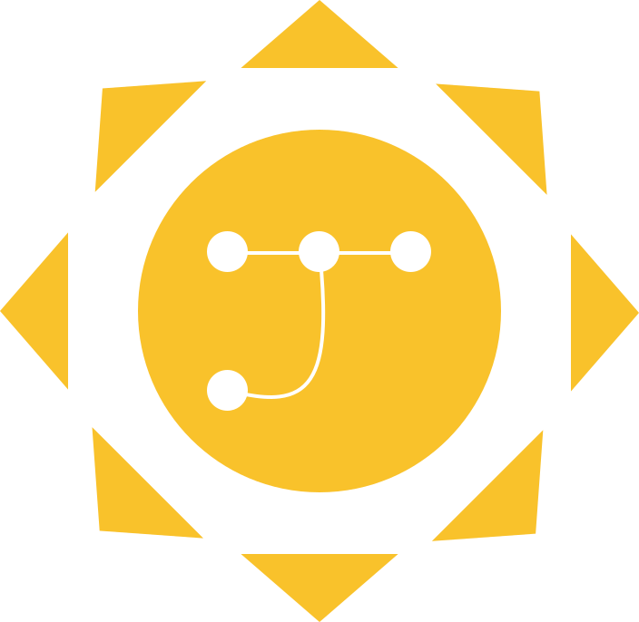

# 🚀 Processo de Construção: Identidade Visual JeanSol

Este documento regista a evolução técnica e criativa da marca **JeanSol**. O objetivo foi criar uma identidade que equilibrasse a robustez da engenharia com a inteligência da ciência de dados.

## 1. O Conceito Inicial (Ideação)
Tudo começou com a ideia de unir o "Sol" (Soluções) com uma estética de engenheiro. O primeiro rascunho explorou o formato através de *pixel art*, estabelecendo a geometria base de um círculo central com raios triangulares.

## 2. Definição da Paleta e Vetorização
Para garantir escalabilidade e profissionalismo, o projeto migrou para o **Figma**. Nesta fase, definimos as cores principais:
* **(#4d9be6)**
* **(#f9c22b)**
* **(ffffff)**

## 3. Exploração do Núcleo (Protótipos)
Um grande diferencial da JeanSol é o que está no seu "núcleo". Testamos três variações para representar diferentes facetas da atuação técnica:

### Variação A: Engenharia de Soluções
Focada em mecanismos e automação, utilizando o símbolo de uma engrenagem.

### Variação B: Análise e Performance
Focada em métricas e resultados, utilizando um gráfico de barras crescente.

### Variação C: Ciência de Dados e IA (Escolha Final)
Esta versão foi a selecionada por representar a modernidade da Ciência de Dados. O grafo/rede neural simboliza a conexão de pontos para gerar *insights*.

## 4. Refinamento Técnico (O Toque Final)
A versão final passou por um processo de "limpeza" geométrica:
1. **Ajuste de Respiro**: Afastámos os triângulos do círculo central para garantir nitidez em tamanhos pequenos.
2. **Boolean Subtract**: O símbolo do grafo foi vazado (subtraído) do sol, permitindo que a marca seja adaptável a qualquer fundo.
3. **Estilização**: As linhas foram afinadas para transmitir a precisão de um algoritmo de IA.

---
**Resultado:** Uma marca escalável, minimalista e que comunica diretamente com o ecossistema de dados e engenharia.
